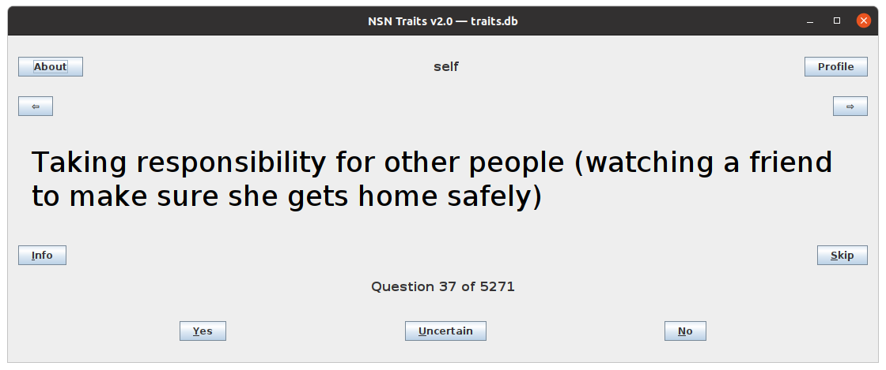

### Building
1. Get Apache Ant — https://ant.apache.org/bindownload.cgi 
2. Compile
```
$ ant
```

### Running
```
$ java -jar traits.jar
Welcome to NSN Traits v2.0 - your daily assistant in learning a personality!

Enter profile name [self]: 
```


```
$ java -jar traits.jar --help
Welcome to NSN Traits v2.0 - your daily assistant in learning a personality!

Usage: traits.jar [options] [profile_name]

Options:
    --help                show this help
    --version             show version
    --about               about info
    --cli                 use command-line interface instead of GUI
    --profile             show traits profile and exit
    --db=[db_file]        database file to use (default - 'traits.db')

Profile name:
    profile_name          name of the profile (default - 'self')

For help and support contact traits@nosocial.net.
```

```
$ java -jar traits.jar --version
v2.0.23
```

```
$ java -jar traits.jar --about
Welcome to NSN Traits v2.0 - your daily assistant in learning a personality!

Answer as many questions as possible to get the personal profile of positive and negative traits.

* Self awareness
  Learn about behaviors, discover your traits and develop emotional intelligence

* Dealing with people
  The more self-aware you are, the more skilled you are at reading personality of others

* A key to life success
  Use NSN Traits v2.0 day by day and watch how your life becomes easier and more successful

Copyright (c) NSN 2015-2022.

For help and support contact traits@nosocial.net.
```

```
$ java -jar traits.jar --cli
Welcome to NSN Traits v2.0 - your daily assistant in learning a personality!

Enter profile name [self]:

Creating the new profile for self and randomizing the questions.

You answered 0 of 5271 questions for self and discovered 0 traits out of 210. 
Profile level is 0.

Staying connected with friends [s/y/n/u/i/p/b/f/?] y
Recognizing effects of own actions [s/y/n/u/i/p/b/f/?] i
This behavior is associated with SOCIALLY RESPONSIBLE trait (positive).

Recognizing effects of own actions [s/y/n/u/i/p/b/f/?] ?

s - skip (to answer later)
y - yes (adds one level to the trait)
n - no (subtracts one level from the trait)
u - uncertain (doesn't change the level of the trait)
i - behavior info / associated trait hint
p - show profile
b - back to the previous question
f - forward towards the last question
? - this help

Recognizing effects of own actions [s/y/n/u/i/p/b/f/?] ^C
```

```
$ java -jar traits.jar --profile self
Welcome to NSN Traits v2.0 - your daily assistant in learning a personality!

You answered 37 of 5271 questions for self and discovered 6 traits out of 210. 
Profile level is 3.

   3 +happy
   2 +socially responsible
   1 +flirtatious
   1 -hypersensitive
   1 -rowdy
...
```

```
$ java -jar traits.jar --cli self
Welcome to NSN Traits v2.0 - your daily assistant in learning a personality!

Congratulations! No more questions left.
Do you want to get back to review the answers or see the final profile? [b/p] p

You answered 5271 of 5271 questions for self and discovered 210 traits out of 210. 
Profile level is 43.

   43 +happy
   22 +socially responsible
   12 +resourceful
...
```

### Database format

```
$ cat traits.db
+HAPPY
Staying connected with friends
!Disconnected from family
-ROWDY
Defacing property
Disrespecting others
...
```

```
$ cat ~/.traits/self/answers
Staying connected with friends [y]
Defacing property [n]
...
```

```
$ cat ~/.traits/self/questions
Reacting inadequately to teasing
!Disconnected from family
...
```
